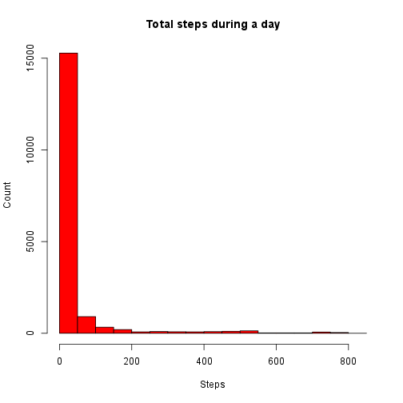

##Introduction

In this project we are going to do some basic exploratory data analysis. Data from personal monitoring device will be used.

Let's load the data:

```r
rawData = read.csv("activity.csv")
rawData$date = as.Date(rawData$date)
summary(rawData)
```

```
##      steps             date               interval     
##  Min.   :  0.00   Min.   :2012-10-01   Min.   :   0.0  
##  1st Qu.:  0.00   1st Qu.:2012-10-16   1st Qu.: 588.8  
##  Median :  0.00   Median :2012-10-31   Median :1177.5  
##  Mean   : 37.38   Mean   :2012-10-31   Mean   :1177.5  
##  3rd Qu.: 12.00   3rd Qu.:2012-11-15   3rd Qu.:1766.2  
##  Max.   :806.00   Max.   :2012-11-30   Max.   :2355.0  
##  NA's   :2304
```

###What is mean total number of steps taken per day?

For this part of the assignment, you can ignore the missing values in the data set.

1. Make a histogram of the total number of steps taken each day.


```r
hist(rawData$steps, xlab = "Steps", ylab = "Count", col = "red", 
     main = "Total steps during a day", ylim = c(0, 14000))
```

 

2. Calculate and report the mean and median total number of steps taken per day.

```r
paste("Mean:", mean(rawData$steps, na.rm = TRUE))
```

```
## [1] "Mean: 37.3825995807128"
```

```r
paste("Median:", median(rawData$steps, na.rm = TRUE))
```

```
## [1] "Median: 0"
```

###What is the average daily activity pattern?

1. Make a time series plot (i.e. type = "l") of the 5-minute interval (x-axis) and the average number of steps taken, averaged across all days (y-axis)

```r
avgStepsOverIntervals = aggregate(steps~interval, data = rawData, FUN = mean, na.rm = TRUE)
plot(avgStepsOverIntervals, type="l", main = "Interval vs Steps")
```

 

2. Which 5-minute interval, on average across all the days in the data set, contains the maximum number of steps?

```r
paste("Interval",
      avgStepsOverIntervals[which.max(avgStepsOverIntervals$steps), "interval"],
      "contains the max average number of steps",
      avgStepsOverIntervals[which.max(avgStepsOverIntervals$steps), "steps"])
```

```
## [1] "Interval 835 contains the max average number of steps 206.169811320755"
```

###Imputing missing values
1. Calculate and report the total number of missing values in the data set (i.e. the total number of rows with NAs)

We can see from the summary earlier that only steps variable has missing values, 2304 of them. In general case, where multiple variables have missing values, we can still calculate ten number of rows having missing values by using command complete.cases:


```r
paste("Total number of rows which contains at least one NA:",
      nrow(rawData) - nrow(rawData[complete.cases(rawData), ]))
```

```
## [1] "Total number of rows which contains at least one NA: 2304"
```

2. Devise a strategy for filling in all of the missing values in the dataset. The strategy does not need to be sophisticated. For example, you could use the mean/median for that day, or the mean for that 5-minute interval, etc.

We will fill the missing steps values by calculating the median number of steps for that interval where there are no missing values. For example if for some date, and interval 100, number of steps is a missing value, than we'll take a median of steps for all the dates at interval 100, where number of steps is not missing.

Median was chosen because it's robust (resilient to outliers).

3. Create a new data set that is equal to the original data set but with the missing data filled in.


```r
medianStepsOverIntervals = aggregate(steps~interval, data = rawData, FUN = median, na.rm = T)
imputedData = rawData
missing = which(is.na(imputedData))
for(i in missing) {
  imputedData[i, "steps"] = medianStepsOverIntervals[medianStepsOverIntervals$interval == imputedData[i, "interval"], "steps"]
}
summary(imputedData)
```

```
##      steps          date               interval     
##  Min.   :  0   Min.   :2012-10-01   Min.   :   0.0  
##  1st Qu.:  0   1st Qu.:2012-10-16   1st Qu.: 588.8  
##  Median :  0   Median :2012-10-31   Median :1177.5  
##  Mean   : 33   Mean   :2012-10-31   Mean   :1177.5  
##  3rd Qu.:  8   3rd Qu.:2012-11-15   3rd Qu.:1766.2  
##  Max.   :806   Max.   :2012-11-30   Max.   :2355.0
```


4. Make a histogram of the total number of steps taken each day and Calculate and report the mean and median total number of steps taken per day. Do these values differ from the estimates from the first part of the assignment? What is the impact of imputing missing data on the estimates of the total daily number of steps?


```r
hist(imputedData$steps, xlab = "Steps", ylab = "Count", col = "red", 
     main = "Total steps during a day", ylim = c(0, 15000))
```

 


```r
paste("Mean:", mean(imputedData$steps, na.rm = TRUE))
```

```
## [1] "Mean: 32.9995446265938"
```

```r
paste("Median:", median(imputedData$steps, na.rm = TRUE))
```

```
## [1] "Median: 0"
```
Mean droped from 37.38 to 33. Since there are few outliers in the data, they pull the mean up, but we imputed the data with median values, which are resilient to outliers, so the average dropped a bit. Median stayed the same.

To see if anything significant changed from imputation we'll make an extra plot, as in first part of the assignment:

```r
plot(aggregate(steps~interval, data = imputedData, FUN = mean, na.rm = TRUE), type="l",  main = "Interval vs Steps")
```

 

The plot is practically indistingvishable from the one with missing data.

###Are there differences in activity patterns between weekdays and weekends?
1. Create a new factor variable in the dataset with two levels – “weekday” and “weekend” indicating whether a given date is a weekday or weekend day.

```r
imputedData$day = as.factor(ifelse((weekdays(imputedData$date) == "Saturday") & (weekdays(imputedData$date) == "Saturday"), "weekend", "weekday"))
summary(imputedData)
```

```
##      steps          date               interval           day       
##  Min.   :  0   Min.   :2012-10-01   Min.   :   0.0   weekday:15264  
##  1st Qu.:  0   1st Qu.:2012-10-16   1st Qu.: 588.8   weekend: 2304  
##  Median :  0   Median :2012-10-31   Median :1177.5                  
##  Mean   : 33   Mean   :2012-10-31   Mean   :1177.5                  
##  3rd Qu.:  8   3rd Qu.:2012-11-15   3rd Qu.:1766.2                  
##  Max.   :806   Max.   :2012-11-30   Max.   :2355.0
```

2. Make a panel plot containing a time series plot (i.e. type = "l") of the 5-minute interval (x-axis) and the average number of steps taken, averaged across all weekday days or weekend days (y-axis). See the README file in the GitHub repository to see an example of what this plot should look like using simulated data.

```r
library(lattice) 
avgStepsOverIntervals = aggregate(steps~interval + day, data = imputedData, FUN = mean, na.rm = TRUE)
xyplot(steps ~ interval | day, data = avgStepsOverIntervals,
    main="Average Steps vs Interval", xlab="Interval", ylab = "Average steps",
    layout=c(1,2), type='l')
```

 

